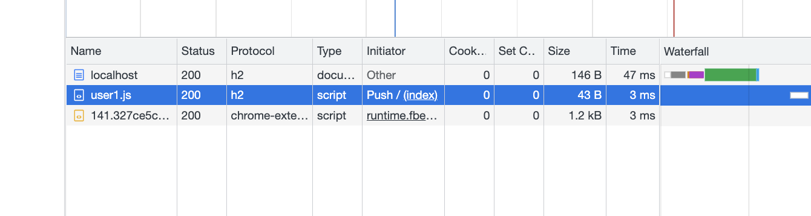
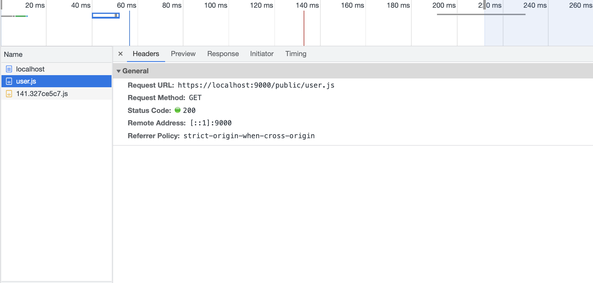

# http2-server-push-example

```javascript
// push一个resource key 需要和请求的资源路径相匹配
const stream = res.push('/public/user.js', {})
stream.end(JSON.stringify({ age: 12 }));
res.end('<div>hello</div><script src="/public/user.js"></script>');
```




